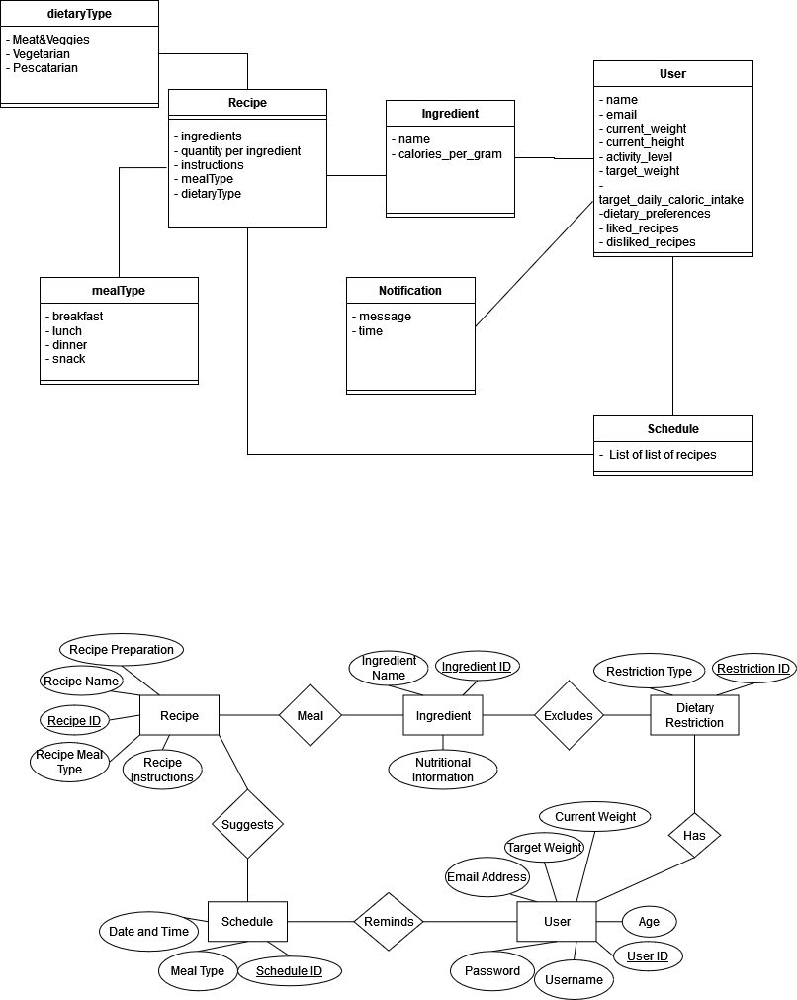

# NutriPapi

Introducing NutriPapi: Your Personalized Health Companion

NutriPapi is an innovative health management platform designed to empower users in achieving their wellness goals effortlessly. Seamlessly integrating advanced features with user-friendly design, NutriPapi provides a comprehensive suite of tools tailored to your individual needs.

With NutriPapi, creating an account is just the beginning. Users can input crucial details such as weight, height, activity levels, and dietary preferences, enabling the system to generate personalized recommendations. Whether you're aiming to shed a few pounds, bulk up, or maintain a balanced lifestyle, NutriPapi's daily suggested caloric intake feature ensures you stay on track with your goals.

Say goodbye to meal planning woes with NutriPapi's intelligent ingredient management system. Simply input the contents of your fridge, and NutriPapi will craft diverse and nutritious meal suggestions customized to your dietary preferences. Plus, with the ability to log daily meals and exercise routines, tracking your progress has never been easier.

NutriPapi goes beyond mere functionality, offering features like generating weekly progress reports, receiving timely reminders to stay on track, and even providing inspiring quotes related to diet and health. 

Security and privacy are paramount, with NutriPapi implementing robust authentication methods and encryption protocols to safeguard sensitive user data.

Experience the future of health management with NutriPapi. Whether you're a fitness enthusiast, health-conscious individual, or simply looking to improve your well-being, NutriPapi is your trusted companion every step of the way.

### Team Members
- Masa Kagami  
- Martin Eskaros  
- Shyam Desai  
- Victor Micha  
- Yuting Li  
- Simon Cao  
- Ahmed Nami  
- Simiao Rao  
- Jingyi Wang  
- Simo Benkirane  

---

## Agile Development
NutriPapi is developed using Agile methodologies. Our development process is anchored in SCRUM, a framework that emphasizes iterative development, continuous feedback, and adaptive planning. This product kicks off with a comprehensive product backlog, meticulously curated and managed using Github Projects. This backlog serves as our compass, guiding us through the myriad of features, user stories, and technical tasks that comprise our development journey.

Our sprint cycle lasts four weeks and it forms the backbone of our development cycle. At the onset of each sprint, our team collaborates to set expectations and select a set of user stories from the backlog. These user stories encapsulate the features and functionalities that we aim to implement within the sprint timeframe. Throughout the sprint, our developers leverage the power of Github for version control and collaboration. Branches are created, code is developed, reviewed, and merged into the main branch, all while adhering to best practices and coding standards.

In addition to our development process, our release pipeline involves various components. We utilize Github for source control, housing the source code, unit tests, automated acceptance tests, and project documentation. Continuous integration is facilitated through Github Actions, ensuring seamless integration of code changes. Team coordination is vital, with weekly online meetings supplemented by in-person discussions, daily scrum meetings held on Microsoft Teams, and planning, retrospective, and demo meetings scheduled at specific sprint milestones. Technical knowledge sharing is facilitated through collaborative project documentation on Github Wiki and key updates communicated via Microsoft Teams and WhatsApp channels. Project tracking and issue resolution are managed within Github, with the scrum master maintaining a weekly task list to ensure progress alignment within the team.

### Scrum Masters
- Sprint A: Shyam Desai, shyam.desai@mail.mcgill.ca
- Sprint B: Masa Kagami, nagamasa.kagami@mail.mcgill.ca

### Done Checklist
- [ ] All story related tasks have been completed.
- [ ] All of a story’s code in integrated into the main source code (i.e. merged into the
master branch).
- [ ] All of a story’s code has been peer reviewed and accepted.
- [ ] All known bugs have been reviewed and documented. Any bugs which block
acceptance tests from passing have been corrected.
- [ ] Unit tests have been written and run and succeed as part of the build process.
- [ ] All previous automated unit tests still succeed.
- [ ] Code builds successfully.
- [ ] All story specific acceptance tests succeed.
- [ ] All story normal and alternate flow story tests are automated and run as part of the
build process.
- [ ] All previous automated story tests still succeed.
- [ ] Any story specific non functional acceptance criteria pass.

---

## Requirements
### User Requirements:
- The NutriPapi system shall allow the user to be able to create an account 
- The NutriPapi system shall allow the user to input their target weight, current weight, height, weekly physical activity
- The NutriPapi system shall allow the user to get a daily suggested caloric intake according to their target/current weight and for how long they want to gain or lose weight
- The NutriPapi system shall allow the user to input the ingredients that they have in the fridge
- The NutriPapi system shall allow the user to set their dietary preferences in the profile (such as vegetarian, vegan, lactose intolerant, no nuts, etc.) to filter out the ingredients from the suggested meals
- The NutriPapi system shall allow the user to set and update their personal information eg weight, height, gender, weight goals
- The NutriPapi system shall allow the user to access and log their meal history 
- The NutriPapi ​system shall allow users to delete the accounts they created.

### System Requirements:
- The NutriPapi system shall send the user daily notifications at 6 pm that their recipes are ready for the next day.
- The NutriPapi system shall be able to filter out suggestions for the ingredients based on the dietary restrictions entered by the user
- The NutriPapi system shall have 4 meals dedicated to breakfast, lunch, dinner, and snacks.
- The NutriPapi system shall allow users to search for the ingredients by their name and get nutritional information about that ingredient.
- The NutriPapi system shall recommend different recipes for different meals on the same day and can only recommend the same meal after 2 weeks unless specified by the user.

### Non-Functional Requirements:
- The NutriPapi ​system should be responsive and compatible with all major operating systems and major browsers.
- The NutriPapi system shall implement secure authentication methods and encrypt sensitive user data
- The NutriPapi system shall be user-friendly, with an intuitive interface that is easy to navigate for a wide range of users, including those with limited technical skills.

### Optional Requirements:
- The NutriPapi system shall allow the user to generate a weekly progress report
- The NutriPapi system shall send the user reminders throughout the day to start preparing their meals and stay on a consistent schedule
- The NutriPapi system shall be able to display a quote of the day that relates to diet each calendar day.
- The NutriPapi system shall allow users to create a custom meal plan based on their dietary preferences and nutritional requirements.
- The NutriPapi system shall allow the users to “like'' and “dislike” the meals they enjoyed and get recommended that same meal on another occasion on a higher frequency.

---

### User Stories
- As a user, I want to create an account on the NutriPapi system so that I can get access to its functionalities
- As a user, I want to input my current weight, target weight, height, weekly physical activity levels, and dietary requirements so that the system can provide me with tailored suggestions on achieving my health goals.
- As a user, I would like to receive a daily caloric intake recommendation so that I can adjust my diet to meet my weight goals.
- As a user, I want to be able to input the ingredients I have in my fridge so that I can keep track of what I have available.  
- As a user who may have lost or gained weight, I want to update my weight in the NutriPapi system so that it can adjust my daily caloric intake recommendations accordingly.
- As a user, I want to log my daily meals so that I can track my progress towards my health goals over time.
- As a user who no longer wishes to use the NutriPapi system, I want to be able to delete my account so that my personal data is removed from the system.
- As a user, I want to receive daily reminders to log my meals, drink water, and exercise so that I can stay consistent with my health routines.
- As a user, I want the system to categorize my meal plans into breakfast, lunch, dinner, and snacks so that I can have a structured and balanced daily eating schedule.
- As a health-conscious user, I want to search for ingredients by name and receive detailed nutritional information about them so that I can make informed choices about the ingredients I use in my meals.
- As a user who enjoys culinary diversity, I want the NutriPapi system to recommend a variety of recipes for different meals each day and ensure that the same meal is not repeated within a two-week period unless I specifically request it.
- As a user who uses multiple devices, I want the NutriPapi system to be responsive and compatible on all my devices so that I can access my meal plans and health tracking.
- As a user concerned about my personal data, I want the NutriPapi system to implement secure authentication methods and encrypt sensitive user data to ensure my privacy and security.

---

## UML Class Diagram and Entity Relationship Diagram

